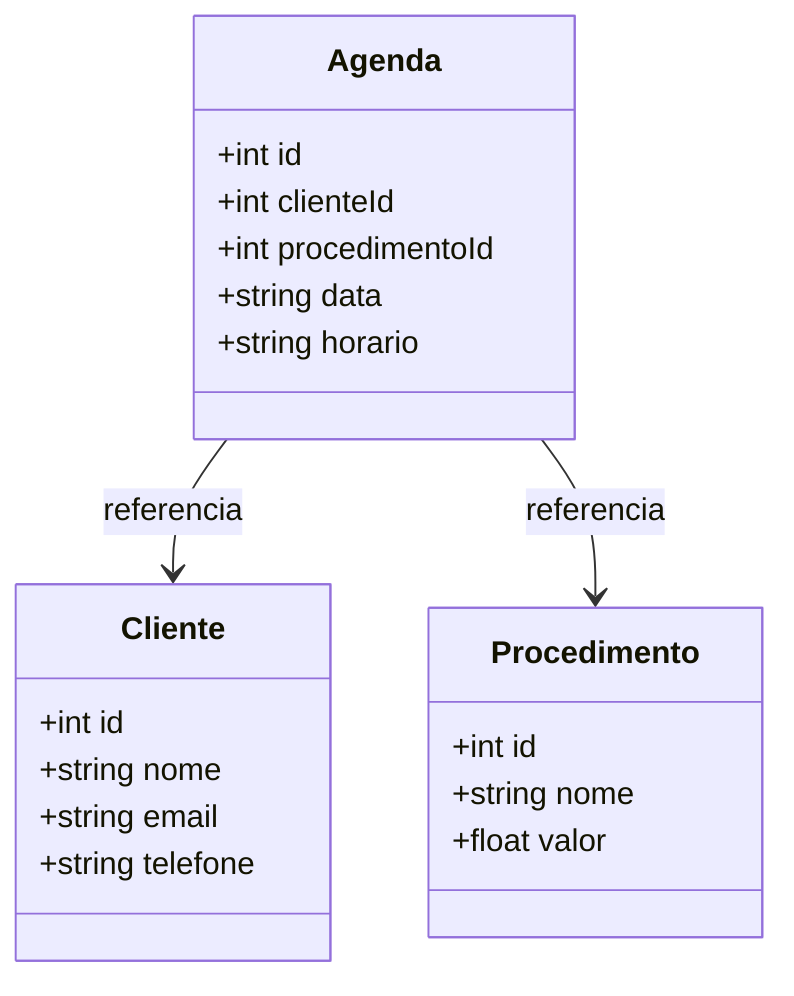

# SistemaAgenda
Java - Agendamento de horários para salão

## Diagrama de classes

```mermaid
classDiagram
    class Cliente {
        +int id
        +string nome
        +string email
        +string telefone
    }

    class Procedimento {
        +int id
        +string nome
        +float valor
    }

    class Agenda {
        +int id
        +int clienteId
        +int procedimentoId
        +string data
        +string horario
    }

    Agenda --> Cliente : referencia
    Agenda --> Procedimento : referencia
```
